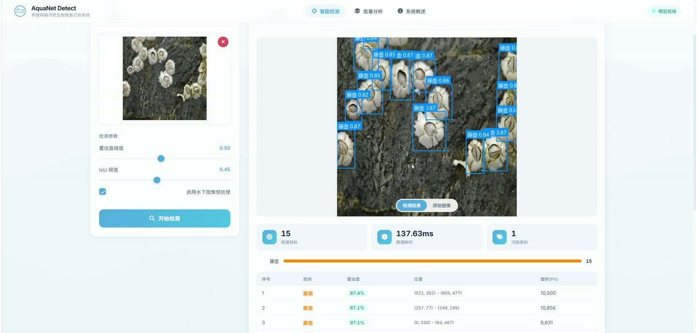
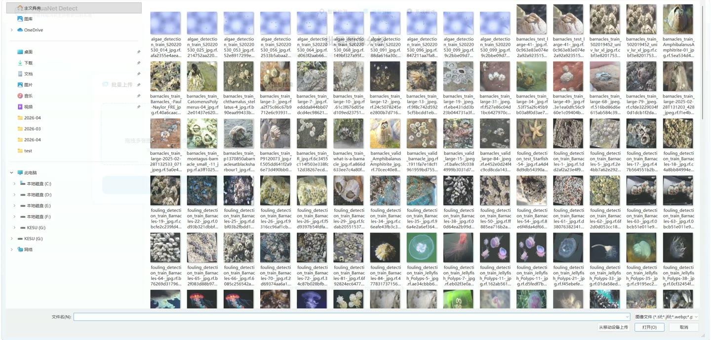
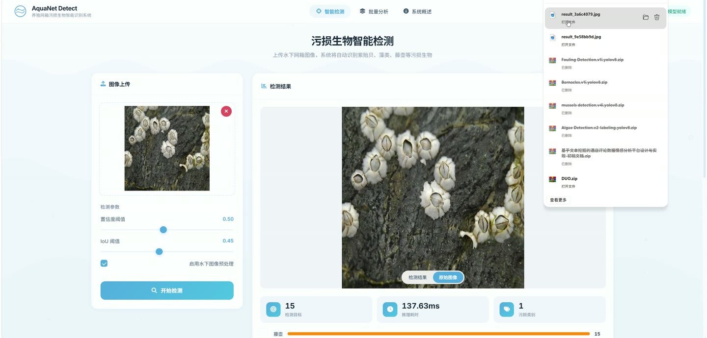
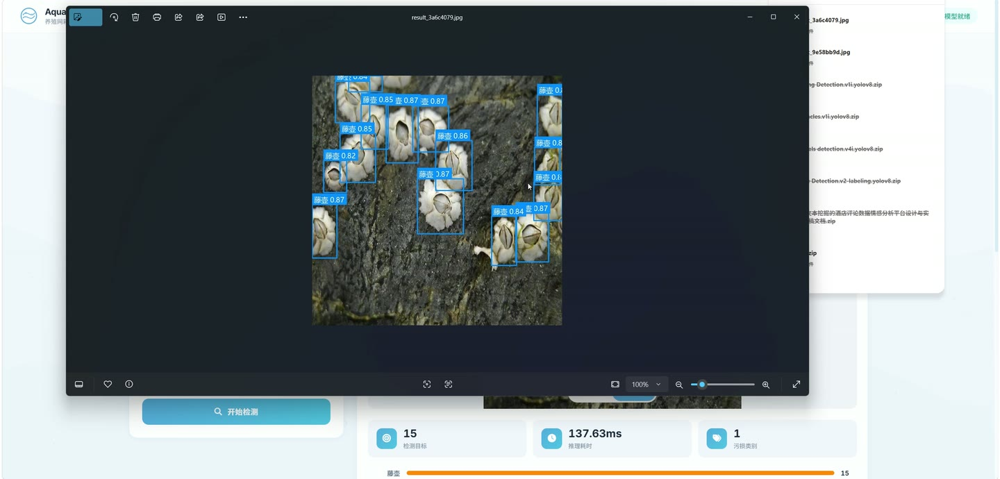
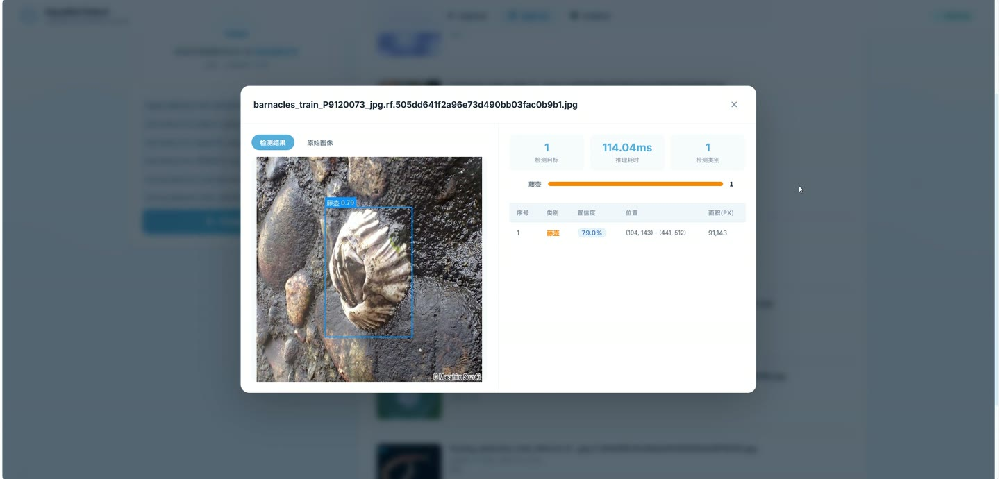
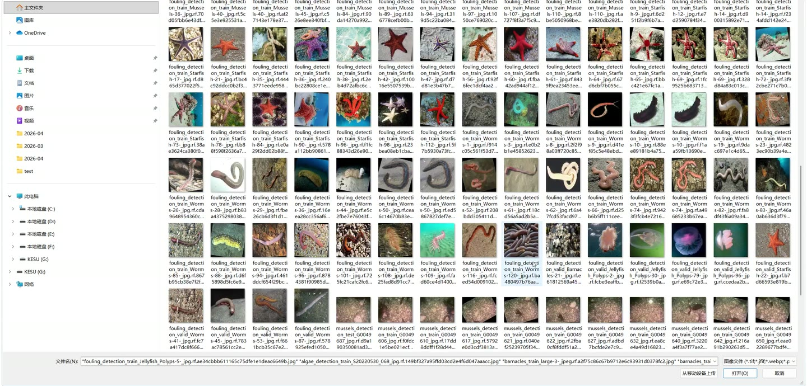

# (附文档)Python+YOLO+深度学习 养殖网箱污损识别

**技术栈**：Python、Flask、PyTorch、YOLO、深度学习

### 系统简介

本系统是一套基于深度学习目标检测的养殖网箱污损生物智能识别平台，采用 Flask 后端与前端页面结合的单体架构。系统内置 YOLOv8m 检测模型，可对紫贻贝、藻类、藤壶、海星、水螅、蠕虫六类污损生物进行自动识别与定位标注，支持单张检测、批量检测、模型信息查询与系统统计，同时提供完整的模型训练、验证与导出脚本。
 
### 核心功能
 
### 普通用户端

- 上传单张图像进行污损生物检测，支持 png、jpg、jpeg、bmp、gif 等常见格式。

- 检测前可自定义置信度阈值与 IoU 阈值，灵活控制检出灵敏度。

- 可选择是否开启图像预处理管线，对原始图像进行增强后再送入模型。

- 查看检测结果图，系统自动在原图上绘制彩色检测框并标注中文类别名称与置信度。

- 查看检测明细列表，逐条展示类别 ID、英文名、中文名、置信度、边界框坐标与目标面积。

- 查看检测汇总信息，包括目标总数、各类别数量统计、推理耗时与图像宽高。

- 批量上传多张图像进行检测，逐张返回结果图、检测列表与推理时间。

- 查看模型信息，包括模型名称、类别列表、类别数量、输入尺寸、默认阈值与模型文件大小。

- 查看系统统计信息，包括累计上传图像数量、累计生成结果数量与当前时间戳。

- 通过主页访问可视化操作界面，完成上传、检测与结果浏览的完整流程。
 
### 管理员端

- 通过训练脚本加载预训练模型，指定数据集配置、轮次、批量大小、图像尺寸与学习率。

- 支持断点续训，可基于上次训练的 last.pt 权重继续训练。

- 配置数据增强参数，包括 HSV 色调/饱和度/明度、旋转角度、平移、缩放、水平与垂直翻转。

- 启用 Mosaic 与 MixUp 增强策略，提升模型泛化能力。

- 设置优化器与早停轮次，训练过程中自动保存权重与可视化图表。

- 训练结束后自动将最佳权重复制到模型目录，供检测服务直接调用。

- 对已训练模型执行验证，输出 mAP@0.5、mAP@0.5:0.95、Precision、Recall 等指标。

- 将模型导出为 ONNX 等格式，便于跨平台部署与推理加速。

- 通过命令行参数灵活覆盖默认训练配置，支持指定训练设备与实验名称。
 
### 技术栈

后端框架Flask
跨域支持Flask-CORS
深度学习框架PyTorch
目标检测模型YOLOv8m（Ultralytics）
图像处理OpenCV、Pillow、NumPy
训练与验证Ultralytics YOLO 训练/验证/导出接口
前端页面HTML 模板 + 静态资源
配置文件config.py 全局参数集中管理
 
### 交付内容

- 后端完整源码

- 前端完整源码

- 数据库初始化脚本

- 万字文档

## 界面展示

---

## 获取完整源码 + 万字文档

本仓库为项目介绍页。**完整前后端源码、数据库初始化脚本、万字项目文档**，请加微信 `kangkangcode`，或访问 [codekk.top](http://codekk.top) 获取。

可作课程设计 / 毕业设计参考，支持远程部署调试。